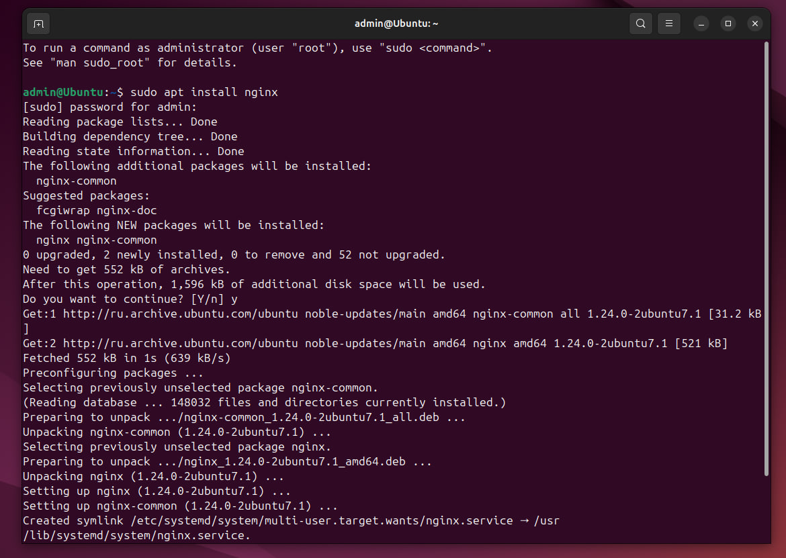

# Лабораторная работа №1 
___
### Задачи

__0. Подготовить Nginx к работе__
__1. Https с сертификатом__
__2. Настроить принудительное перенаправление на https__
__3. Внедрить Alias для псевдонимов путей__
__4. Виртуальные хосты для нескольких доменных имен на 1 сервере__

___

### Предварительный этап: подготовка Nginx

__1. Устанавливаем пакет через терминал__
```
sudo apt install nginx
```


__2. Запускаем Nginx и убеждаемся в его корректной работе(ну а вдруг не запустило)__

Код для запуска
```
sudo systemctl start nginx
```
Код для проверки статуса
```
sudo systemctl status nginx
```

т.к. зеленые слова утверждают, что сервер активен
можно переходить к следующим шагам

__3. Проверяем что там на localhost-е происходит в данный момент__

Запускаем веб-браузер, вписываем в url localhost и видим _Welcome page_

Все работает так, как и должно работать, Nginx __успешно__ установлен 

### Этап 1: HTTPS с сертификатом

__1. Подключение SSL__
Чтоб подключить SSL надо его иметь, чтоб его иметь его нужно получить или создать самоподписанный. В данном случае обойдемся __самоподписанный__ SSL сертификатом созданным через ___openssl___.

Создаем папку для его хранения с помощью:
```
sudo mkdir ssl_cert
```
И далее создаем в ней сам сертификат командой:
```
sudo openssl req -x509 -nodes -days 365 -newkey rsa:2048 -keyout /etc/nginx/ssl_cert/key.key -out /etc/nginx/ssl_cert/cert.crt
```
После запуска последней вводим некоторые данные и получаем готовый SSL


__2. Изменяем конфигурацию__

По пути: /etc/nginx/sites-available/default находим файл с конфигурации и добавляем следующий код
```nginx
listen 443 ssl;
ssl_certificate_key /etc/nginx/ssl_cert/key.key;
ssl_certificate /etc/nginx/ssl_cert/cert.crt;
```
<article id = "save_command">Сохраняем файл и проверяем на наличие очепяток* и других ошибок командой:</article>

```
sudo nginx -t
```

Видим,что __syntax is ok__ и __test is successful__
Празднуем такой успех перезагрузкой Nginx для внесения изменений
```
sudo service nginx restart
```
__3. Смотрим на результат__

Через браузер заходим на страницу https://127.0.0.1 и видим окно предупреждения о вредоностности этого сайта, успешно игнорируем его и попадаем на <s>удивительно</s> уже знакомую страницу


Однако в этот раз имеем сертификат, хоть и не действительный

### Этап 2: Редирект на HTTPS

Для того чтоб бедного пользователя принудительно опрокидывало с HTTP на HTTPS для его же безопасности, заходим в уже знакомый нам /etc/nginx/sites-available/default файл и добавляем новый отдельный server

```nginx
server {
    listen 80 default_server; 
    listen [::]:80 default_server;
    return 301 https://$host$request_uri;  
}
```
Проверяем и перезапускаем __<a href="#save_command">все тем же способом</a>__ и радуемся за пользователя

### Этап 3: Внедрение Alias для псевдонимов путей 

__1. Создание директории сайта__
Для начала создадим папку откуда мы будем хранить сам сайт и папку откуда хотим брать файлы для использования
``` 
sudo mkdir /var/www/nginxproj.com
```
Внутри этой директории создадим еще одну для хранения изображений и переместим в нее cat.png

``` 
sudo mkdir /var/www/nginxproj.com/img
```
Для получения желаемого (например кота из /var/www/nginxproj.com/img/cat.png) через обходной путь (к примеру /img/cat.png) добавим в конфигурацию сервера следующий код содержащий тот самый alias:
```nginx
location /img/ { 
        alias /var/www/nginxproj.com/img/; 
    }
```
После __<a href="#save_command">проверки и перезапуска</a>__ получаем такой результат


Теперь кот доступен через обходной путь в виде __/img/cat.png__

### Этап 4: Виртуальные хосты для нескольких доменных имен на 1 сервере

__1. Создание директории 2-ого сайта и добавление сайтам их страниц__

Для начала создадим папку для 2-ого сайта, ибо она еще не была создана
```
sudo mkdir /var/www/nginxprojtrue.ru
```
Теперь, когда у нас есть два отдельных сайта, пора им обзавестись своими __index.html__
Создадим нашим сайтам папку для его хранения
```
sudo mkdir /var/www/nginxproj.ru/html
sudo mkdir /var/www/nginxprojtrue.ru/html
```
Внутри /nginxproj.ru/html создаем __index.html__ с помощью __nano__
(ну или других пакетов, например __vim__ если у вас крепкие нервы)
```
sudo nano index.html
```
В текстовый редактор помещаем незамысловатый html код
```html
<!DOCTYPE html>
<html lang="en">
<head>
    <meta charset="UTF-8">
    <meta name="viewport" content="width=device-width, initial-scale=1.0">
    <title>nginxproj</title>
</head>
<body>
    <h1>local.nginxprojtrue.com is Fake</h1>
</body>
</html>
```
Проделываем то же самое в дерриктории /nginxprojtrue.ru/html немного изменив текст и title
```html
<!DOCTYPE html>
<html lang="en">
<head>
    <meta charset="UTF-8">
    <meta name="viewport" content="width=device-width, initial-scale=1.0"> 
    <title>nginxprojtrue</title>
</head>
<body>
    <h1>local.nginxproj.com is Fake</h1>
</body>
</html>
```

__2. Редирект на localhost__

Теперь мы имеем в распоряжении 2 сайта с доменами nginxproj\.com и nginxprojtrue\.com. Домена два, localhost один. Добавим доменам редирект на localhost с помощью изменения кода в /etc/hosts
```
127.0.0.1       local.nginxproj.com
127.0.0.1       local.nginxprojtrue.com
```

__3. Настройка виртуальных хостов__
Чтобы несколько доменных имен пахали на одном сервере, нужно создать им __отдельные блоки server__ для каждого. В идеале даже было бы разбить на отдельные файлы. В данном случае уместим их двух в __/etc/nginx/sites-available/default__

```nginx
#server config for nginxproj
server {
	listen 443 ssl;
	ssl_certificate_key /etc/nginx/ssl_cert/key.key;
	ssl_certificate /etc/nginx/ssl_cert/cert.crt;

	root /var/www/nginxproj.com/html;
	index index.html;
	server_name local.nginxproj.com;

	location / {
		try_files $uri $uri/ =404;
	}

	location /img/ { 
        alias /var/www/nginxproj.com/img/; 
    }
}

#server config for nginxprojtrue
server {
	listen 443 ssl;
	ssl_certificate_key /etc/nginx/ssl_cert/key.key;
	ssl_certificate /etc/nginx/ssl_cert/cert.crt;

	root /var/www/nginxprojtrue.com/html;
	index index.html;
	server_name local.nginxprojtrue.com;

	location / {
		try_files $uri $uri/ =404;
	}

}
```
После изменения в файле проводим очередную (финальную) __<a href="#save_command">проверку и перезапуск</a>__, далее получаем такой результат:

Для nginxproj


И такой для nginxproj

___

# Итог
__1. Все работает__
__2. Знакомство с nginx было увлекательно__


