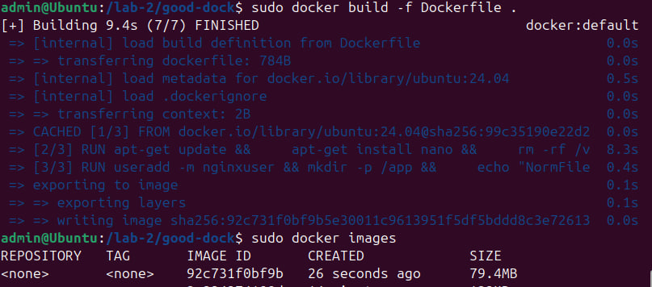

# 2. Плохой и хороший Dockerfile
___

## Плохие практики в написании Dockerfile и их фикс
```dockerfile
# Не крутая практика 1: Использование latest-тега
FROM ubuntu:latest

# Не крутая практика 2: Многоступенчатая установка пакетов без очистки кеша
RUN apt-get update && apt-get install nano

# Не крутая практика 3: Запуск от пользователя root
RUN mkdir /app && echo "NotGoooodFile" > /app/badfile.txt

CMD ["sh", "-c", "echo 'Running as user:' $(whoami)"]
```
1. Использование latest тега в базовом образе:
    * __Проблема:__ В FROM ubuntu:latest используем тег latest, который не фиксирует конкретную версию образа.
    * __Почему же плохо:__ Образ latest может измениться в будущем, что приведет к непредсказуемым изменениям, а это нехорошо, могут возникнуть проблемы с зависимостями и нестабильностью контейнера.
    * __Фикс:__ В хорошем Dockerfile указана конкретная версия FROM ubuntu:20.04, что обеспечивает  предсказуемость поведения.
2. Неочищенный cash после установки пакетов:
   * __Проблема:__ В RUN apt-get update && apt-get install nano после установки пакетов кеши остаются неочищенными.
   * __Почему же плохо:__ Это увеличивает размер образа и замедляет работу контейнера.
   * __Фикс:__ В хорошем Dockerfile добавлена команда rm -rf /var/lib/apt/lists/*, которая очищает cash и уменьшает размер образа.
3. Запуск контейнера от имени root:
    * __Проблема:__ В плохом Dockerfile все действия выполняются от имени root, что небезопасно.
    * __Почему же плохо:__ Запуск контейнера от имени root увеличивает риск, так как любой уязвимый код или процессы внутри контейнера имеют максимальные права.
    * __Фикс:__ В хорошем Dockerfile создается пользователь nginxuser, назначается право на папку и указано USER nginxuser для безопасного выполнения команд с минимальными правами.

### С проблемами разобрались, стартуем


__Все сбилдилось без ошибок, запускаем__


__User в данный момент root, что неудивительно, теперь перейдем к Good Dockerfile__

___

## Код good Docker
Исправляем плохие практики
```dockerfile
# Указываем версию, чтобы избежать неопределенности
FROM ubuntu:24.04

# Устанавливаем пакеты и очищаем cash для минимизации размера образа
RUN apt-get update && \
    apt-get install nano && \
    rm -rf /var/lib/apt/lists/*

# Создаем пользователя и директорию, назначаем нужные права
RUN useradd -m nginxuser && mkdir -p /app && \
    echo "NormFile" > /app/mybestfile.txt && \
    chown -R nginxuser:nginxuser /app

# Переходим на пользователя с минимальными правами
USER nginxuser
CMD ["sh", "-c", "echo 'Running as user:' $(whoami)"]
```

Ну теперь пора билдить



__Ошбиок нет, сбилдилось даже быстрее чем в прошлом варианте, запускаем__


__Теперь юзер уже не root, it's good__

___

## Хороший Docker есть, что дальше


1. __Отсутствие ограничений на ресурсы (--memory и --cpus)__

   * __Проблема:__ Без указания ограничений контейнеры могут потреблять неограниченные ресурсы хоста, что особенно критично при запуске множества контейнеров.
   * __Что же плохого:__ Контейнер без ограничений может потреблять больше ресурсов, чем ожидалось, приводя к снижению производительности и нестабильности всего хоста. Это может вызвать проблемы с доступностью других контейнеров.
   * __Как будем фиксить__ Использовать флаги --memory и --cpus для ограничения максимального использования ресурсов контейнером. Например, --memory="512m" и --cpus="1" ограничат контейнер до 512 MB RAM и 1 CPU.

2. __Отсутствие мониторинга контейнеров и их логов__
    * __Проблема:__ Часто контейнеры запускаются без настроенного мониторинга и сбора логов, что усложняет отслеживание их состояния и работы.
    * __Что же плохого:__ Без мониторинга сложно заметить проблемы, такие как падения контейнеров, чрезмерное потребление ресурсов или ошибки в приложении. Это может привести к снижению доступности и проблемам в продакшене.
    * __Как будем фиксить__ Использовать инструменты мониторинга и логгирования, такие как Prometheus, Grafana, ELK Stack или Docker встроенные логи. Это позволит отслеживать статус контейнеров, быстро реагировать на проблемы и управлять нагрузкой.
    * __P.s.__ Да и вообще логи это всегда круто
