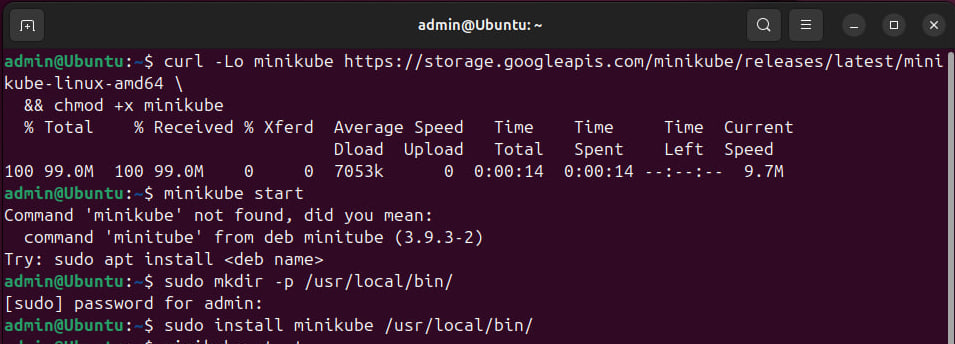
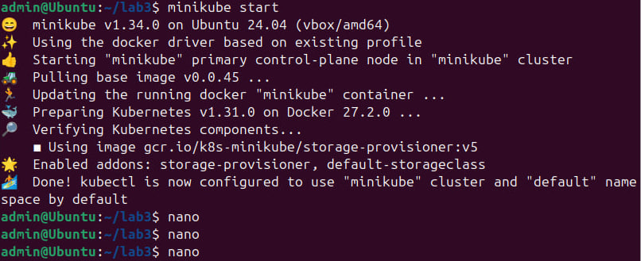
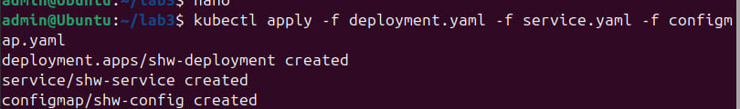
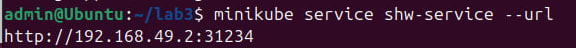
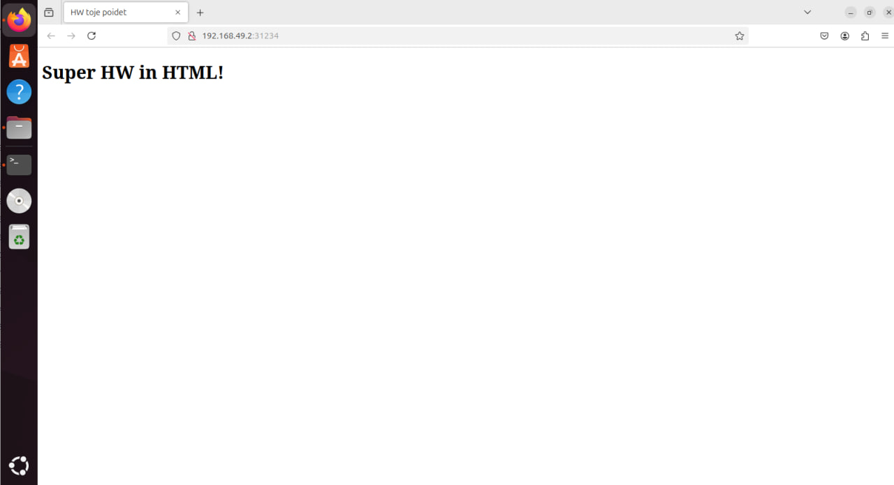

# 3. Поднять kubernetes кластер локально и показать рабочий сервис
___

## Установка Minikube с помощью прямой ссылки и kubectl
```
curl -Lo minikube https://storage.googleapis.com/minikube/releases/latest/minikube-linux-amd64 \
  && chmod +x minikube
```

Чтобы исполняемый файл Minikube был доступен из любой директории выполните следующие команды:
```
sudo mkdir -p /usr/local/bin/
sudo install minikube /usr/local/bin/
```



__С Minikube разобрались, теперь kubectl__

```
sudo snap install kubectl --classic
```


__Все что нужно установить - установленно, за работу__

___

## Стартуем в minikube и Напишем service, deployment и configmap
Запускаем minikube командой:
```
minikube start
```



Далее создаем файлы service, deployment и configmap


__service.yaml__

```yaml
apiVersion: v1
kind: Service
metadata:
  name: shw-service
spec:
  type: NodePort
  ports:
  - port: 80
    targetPort: 80
    nodePort: 31234
  selector:
    app: hw

```

__deployment.yaml__

```yaml
apiVersion: apps/v1
kind: Deployment
metadata:
  name: shw-deployment
spec:
  replicas: 1
  selector:
    matchLabels:
      app: hw
  template:
    metadata:
      labels:
        app: hw
    spec:
      containers:
      - name: hw
        image: nginx:alpine
        ports:
        - containerPort: 80
        volumeMounts:
        - name: html
          mountPath: /usr/share/nginx/html
      volumes:
      - name: html
        configMap:
          name: shw-config


```

__configmap.yaml__

```yaml
apiVersion: v1
kind: ConfigMap
metadata:
  name: shw-config
data:
  index.html: |
    <!DOCTYPE html>
    <html>
    <head>
        <title>HW toje poidet</title> <!-HW=hello world-->
    </head>
    <body>
        <h1>Super HW in HTML!</h1>
    </body>
    </html>


```
___

## Развораразворачивать кодом из yaml и смотрим что получаем в результате

__Развернем все ресурсы с помощью__
```
kubectl apply -f deployment.yaml -f service.yaml -f configmap.yaml
``` 


__Проверяем__

```
minikube service shw-service --url
```



__Глянем результат__



__Получаем вывод SUPER HW in HTML!__
